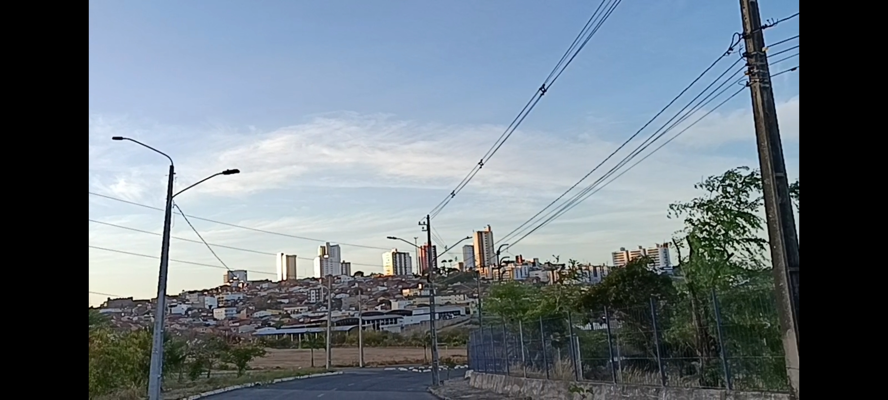

# Ayza 🐝
I bike around the city and I like landscapes, games, anime, and programming.

<table align="center" cellspacing="12">
  <tr>
    <td style="border:1px solid #333; border-radius:8px; padding:6px;">
      
    </td>
    <td style="border:1px solid #333; border-radius:8px; padding:6px;">
      
    </td>
    <td style="border:1px solid #333; border-radius:8px; padding:6px;">
      
    </td>
  </tr>
  <tr>
    <td style="border:1px solid #333; border-radius:8px; padding:6px;">
      
    </td>
    <td style="border:1px solid #333; border-radius:8px; padding:6px;">
      
    </td>
    <td style="border:1px solid #333; border-radius:8px; padding:6px;">
      
    </td>
  </tr>
</table>

  

 

## Stuff I worked
- [Juntoo](https://apps.apple.com/br/app/junto%24/id1563846408): Ergonomic framework for Humans
- [Guardião do Consumidor](https://niku.saltyaom.com](https://apps.apple.com/br/app/guardião-do-consumidor/id6753079908)): Effortlessly compose your Flutter UI for humans.
