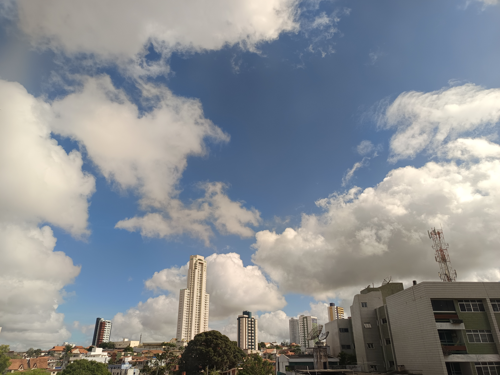
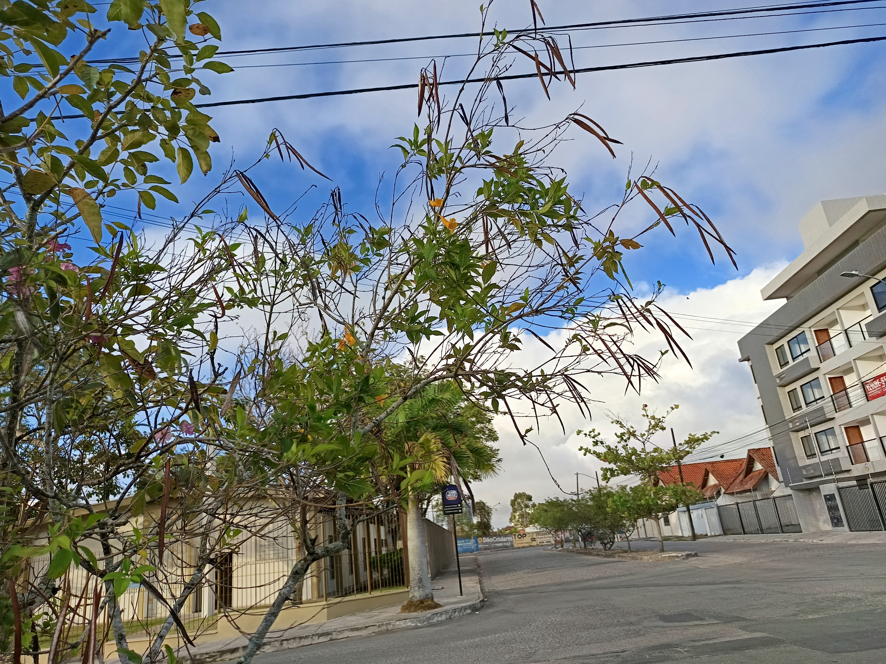

# Ayza 🐝
I bike around the city and I like landscapes, games, anime, and programming.

 

  
  
  
   
  

  

 

## Stuff I worked
- [Juntoo](https://apps.apple.com/br/app/junto%24/id1563846408): App de linha de crédito.
- [Guardião do Consumidor](https://niku.saltyaom.com](https://apps.apple.com/br/app/guardião-do-consumidor/id6753079908)): App para consultar estado de crédito
